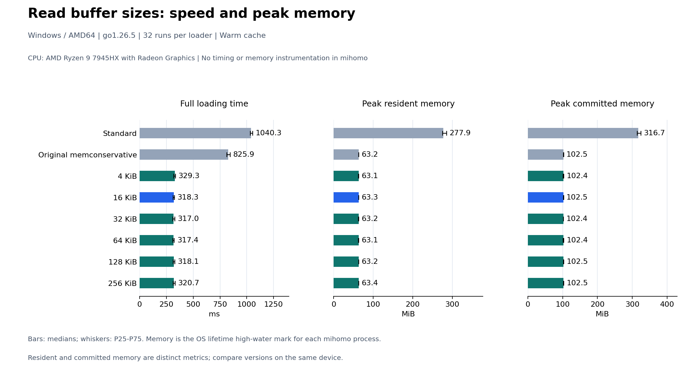

# GeoData Loader Speed and Peak Memory Tests

The production read buffer is currently **16 KiB**. By default, the test compares three variants: upstream `standard`, upstream `memconservative`, and `memconservative` with buffered reads. All three run an uninstrumented `mihomo -t`; the parent process records total loading time, CPU time, and peak memory over the child's entire lifetime.

## Running the tests

Run from the repository root on the test branch:

```sh
python3 scripts/geosite-review/run.py
```

Use `python` on Windows. Git, Python, and a native Go 1.26 toolchain are required. Plotting dependencies are installed in an isolated environment under output. By default, each variant is warmed up once and measured thirty times. Execution order rotates each round, so each variant occupies each position ten times over thirty rounds.

| Option | Purpose |
| --- | --- |
| `--base <ref>` | Upstream baseline; defaults to local origin/Alpha, which is not automatically refreshed if present |
| `--optimized-ref <ref>` | Read decode.go from this commit; defaults to the working-tree file |
| `--rounds <count>` | Measurements per variant; defaults to 30 |
| `--buffer-sizes <KiB...>` | Compare standard, original memconservative, and optimized variants with the specified buffer sizes |
| `--data-dir <directory>` | Use existing geosite.dat and geoip.dat files |
| `--refresh-data` | Refresh the dat cache |
| `--config <file>` | Custom configuration; must explicitly contain one top-level geodata-loader setting |
| `--go <file>` | Specify the Go executable |
| `--tags <tags>` | Defaults to with_gvisor |
| `--output-dir <directory>` | Results and cache directory |

On another Linux device, pull the test branch and run the same entry point. No input-bundle.zip is required.

## Keeping the comparison consistent

Both source copies are created from the same upstream baseline using git archive. The optimized copy replaces only `component/geodata/memconservative/decode.go`. Other functional changes on the test branch, including the DomainSetBuilder optimization, are excluded from this comparison.

| Variant | Binary | Configured loader |
| --- | --- | --- |
| standard | Upstream baseline | standard |
| memconservative | Upstream baseline; the same binary used by standard | memconservative |
| optimized_memconservative | Upstream baseline plus optimized decode.go | memconservative |

The three YAML configurations differ only in geodata-loader; the two memconservative configurations are identical. Data, toolchain, build flags, and output redirection are shared. Baseline and optimized file hashes, binary hashes, and configuration hashes are recorded in manifest.json.

The default test.yaml covers GeoSite, GeoIP, attribute filtering, negation, DNS, and category reuse through fake-IP settings. Each run checks the exit code, success log, and consistency of GeoData rules and record counts. This is not a byte-for-byte Decode comparison, a traffic-forwarding test, or a complete matcher-equivalence test.

## Metrics and scope

| Field | Meaning |
| --- | --- |
| `load_ms` | Wall-clock time from the parent's creation of mihomo -t until it finishes waiting for the child to exit |
| `cpu_ms` | Cumulative child-process user and kernel CPU time; distinct from wall-clock time |
| `peak_resident_bytes` | The operating system's peak resident-memory counter for this child process |
| `peak_commit_bytes` | Peak committed memory for this child process on Windows; not provided on Linux |

On Windows, the process handle is retained after exit. GetProcessMemoryInfo reads PeakWorkingSetSize and PeakPagefileUsage, while GetProcessTimes reads CPU time. Linux uses ru_maxrss from wait4 for the specific PID, converting KiB to bytes, plus ru_utime/ru_stime. The collector neither uses cumulative RUSAGE_CHILDREN counters, which could retain another child's peak, nor polls periodically.

Memory values are operating-system high-water marks for the entire mihomo process, including initialization, configuration loading, and Go heap/stack memory. They are not limited to geodata, cumulative allocation B/op, or Go HeapAlloc. Resident and committed memory are different metrics and must not be added together. Compare variants on the same device; differences between Windows working-set and Linux RSS figures alone do not establish which operating system is better.

No timing, hashing, or memory-sampling wrappers are added to production code in any variant. Log validation runs after process exit. This workflow measures loading speed and peak memory, not individual Decode or GeoSite construction stages.

## Output and statistics

Results are saved to `output/geosite-review/loaders-<UTC-time>-<id>/`:

- manifest.json: versions, inputs, build settings, system information, memory metric definitions, and completion status.
- measurements.json: raw timing and memory values for each round and variant, in execution order.
- summary.json: medians, P25/P75, ranges, standard deviations, and pairwise differences within each round.
- timing-comparison.png / svg: median bar charts with P25-P75 error bars.
- baseline/ and optimized/: uninstrumented source copies, binaries, and build logs.
- standard/, memconservative/, and optimized_memconservative/: variant configurations and individual loading logs.

Paired differences are calculated as reference minus candidate within the same round. Positive values mean the candidate is faster or uses less memory. Both positive and negative memory differences, variability, and counts of lower/higher rounds are retained. Slow samples are not removed, and statistical significance is not automatically declared. Memory is displayed in MiB (1 MiB = 1,048,576 bytes).

The default workload measures configuration loading with a warm file cache. OS peak counters are not periodic-sampling estimates. Data and dependency preparation, compilation, and plotting are excluded from measurements. The workload runs sequentially; variants are not executed concurrently.

## Validating the collector

```sh
python3 -B scripts/geosite-review/process_metrics_test.py
```

The checks use real child processes to verify that a peak remains observable after allocating and releasing 64 MiB, that a subsequent small process does not inherit the previous peak, and that nonzero exit codes are preserved. No mocked counters are used. The Windows path has been validated on this device. The Linux path uses native wait4; results must be recorded after running it on a Linux device.

References: [Windows memory counters](https://learn.microsoft.com/en-us/windows/win32/api/psapi/ns-psapi-process_memory_counters), [Linux wait4](https://man7.org/linux/man-pages/man2/wait4.2.html), and [Linux ru_maxrss](https://man7.org/linux/man-pages/man2/getrusage.2.html).

## Buffer-size experiment

```sh
python3 scripts/geosite-review/run.py --buffer-sizes 4 16 32 64 128 256 --rounds 32
```

This mode includes standard, original memconservative, and six optimized buffer sizes: eight variants in total. With one warmup and 32 measured rounds per variant, each variant occupies each execution position four times. Only the read-buffer size is changed in the experimental source copies; other source files, data, and memconservative settings remain identical. Standard and original memconservative use the same upstream binary with different loader settings.

summary.json provides paired differences against standard, original memconservative, and the current default size (16 KiB). The chart highlights the current default in blue. Compare results from the same batch; whole-process peak memory need not scale linearly with buffer size.

## Final 16 KiB default and combined comparison: 2026-09-12, Windows

The production buffer was reduced from 64 KiB to 16 KiB; other functionality is unchanged. To avoid combining measurements from different batches, standard, original memconservative, and optimized 4/16/32/64/128/256 KiB variants were measured together.

```powershell
python scripts/geosite-review/run.py --buffer-sizes 4 16 32 64 128 256 --rounds 32
```

All variants used upstream baseline dca26db0, the same dat files and default configuration containing multiple categories, Go 1.26.5, and Windows 11 on a Ryzen 9 7945HX. The optimized source replaced only decode.go from the working tree and excluded the DomainSetBuilder optimization. Each variant was warmed up once and measured 32 times. All 264 loading processes succeeded with consistent rule records; each variant occupied each execution position four times.



All values below are medians. Memory values are medians of the individual processes' lifetime peaks, in MiB.

| Variant | Total loading ms | CPU time ms | Peak working set MiB | Peak committed memory MiB |
| --- | ---: | ---: | ---: | ---: |
| standard | 1040.30 | 1507.81 | 277.89 | 316.71 |
| memconservative | 825.92 | 851.56 | 63.17 | 102.52 |
| Optimized 4 KiB | 329.25 | 359.38 | 63.08 | 102.45 |
| Optimized 16 KiB (current default) | 318.31 | 390.62 | 63.30 | 102.51 |
| Optimized 32 KiB | 317.01 | 390.62 | 63.21 | 102.38 |
| Optimized 64 KiB | 317.40 | 375.00 | 63.14 | 102.39 |
| Optimized 128 KiB | 318.11 | 390.62 | 63.21 | 102.54 |
| Optimized 256 KiB | 320.72 | 382.81 | 63.37 | 102.50 |

Compared with original memconservative, the 16 KiB variant saved a median **506.22 ms (61.62%)** within paired rounds and was faster in all 32 rounds. Its peak working set was close to the other memconservative variants; this does not imply zero additional memory cost. Choosing 16 KiB balances a smaller fixed allocation per call with the measured speed, rather than claiming an optimal size for every device and configuration.

[Raw measurements](reports/all-loaders-buffers-windows-7945hx-20260912/measurements.json), [distributions and paired statistics](reports/all-loaders-buffers-windows-7945hx-20260912/summary.json), and [input and version hashes](reports/all-loaders-buffers-windows-7945hx-20260912/manifest.json). The complete run directory is `output/geosite-review/buffers-20260912T064931Z-cf908bf4/`.

The relevant Go regression tests and real-child-process peak-memory collector tests passed. Measurements used uninstrumented binaries, and no outliers were removed. This comparison has not yet been run on Linux.
